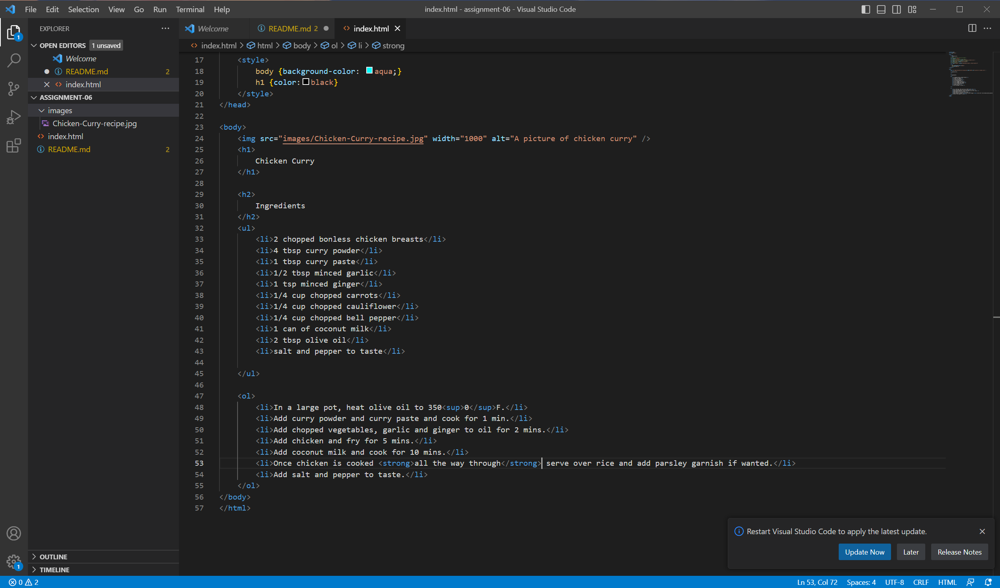

The main difference between structural and semantic elements is that semantic elements explain the purpose of an element, while structural elements explain the relation of its content to the content of other elements within a document.

