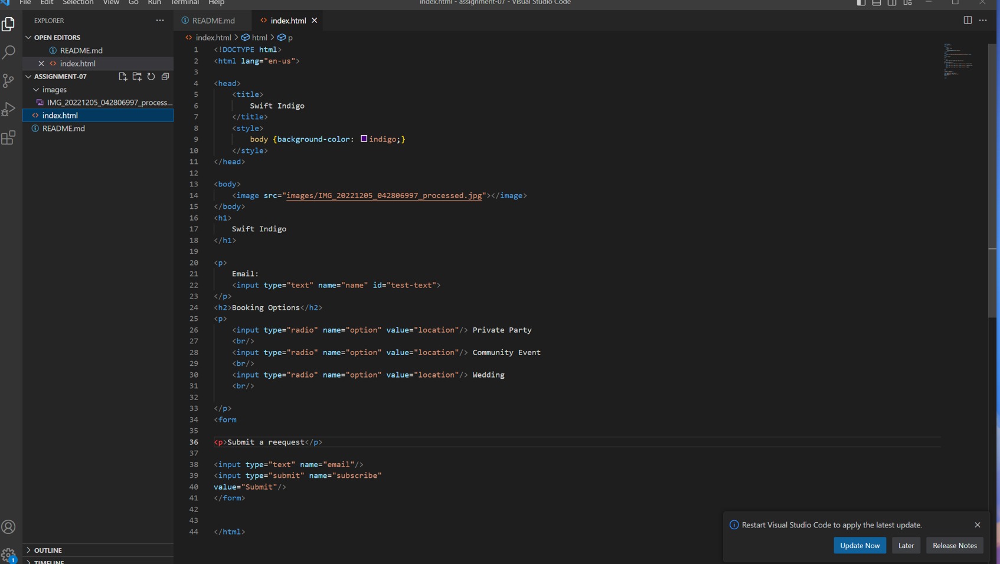

While I was watching YouTube I noticed that there is a subscribe button underneath every video. This allows the user to subscribe to the channel so that content from there will show up in the users feed. 
